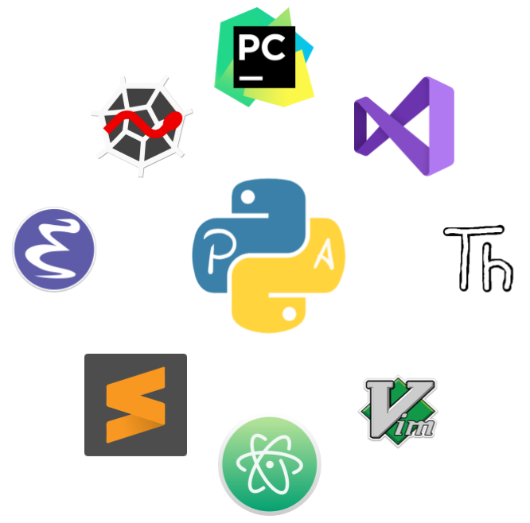

  

## JUNIT
* Pruebas utilizando la herramienta [Junit](https://github.com/SabrinaOC/SabrinaEjerciciosEntornosDesarrollo/tree/master/src/pruebaJunit) en Eclipse.

- - -

## EDI
* Uso e instalación de diversas herramientas y plugins de Eclipse [window builder, ER Master y PHP](https://github.com/SabrinaOC/SabrinaEjerciciosEntornosDesarrollo/tree/master/src/practica_obligatoria_2_EDI).

- - -

## UML
* Ejemplos de diagramas de uso y diagramas de clases con [UMLet y StarUML](https://github.com/SabrinaOC/SabrinaEjerciciosEntornosDesarrollo/tree/master/src/uml).

- - -

## ANDROID STUDIO
* Proyectos en java para Android con la plataforma de desarrollo [Android Studio](https://github.com/SabrinaOC/SabrinaEjerciciosEntornosDesarrollo/tree/master/src/androidStudio/Calculadora).
