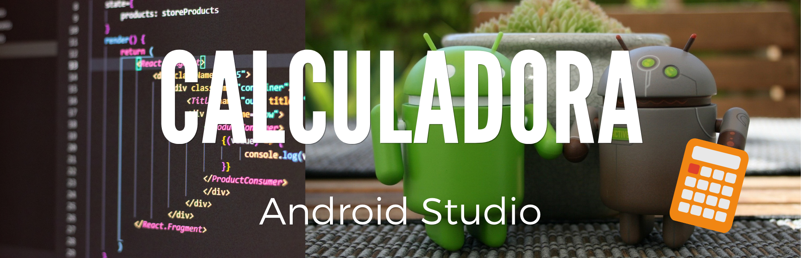
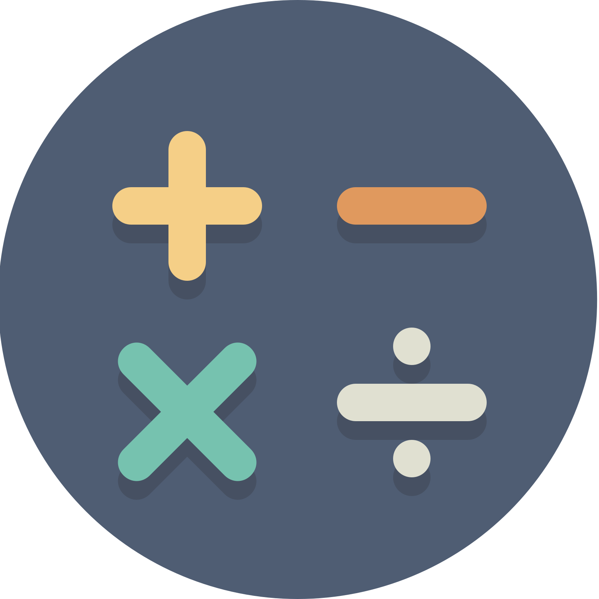
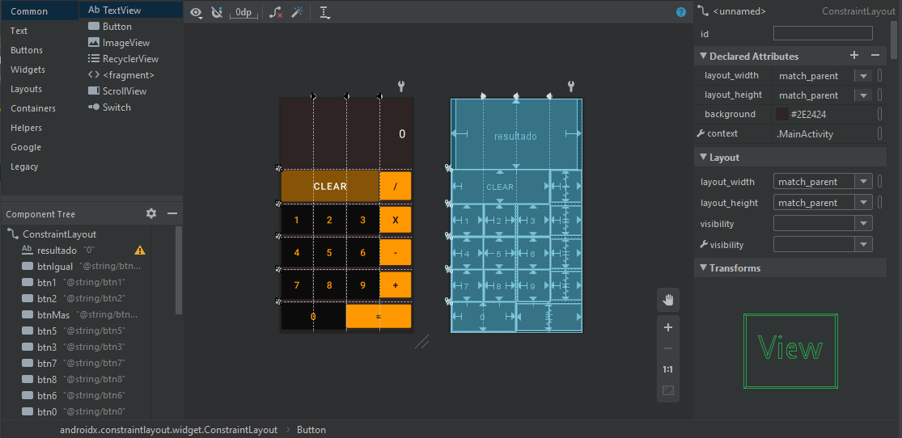
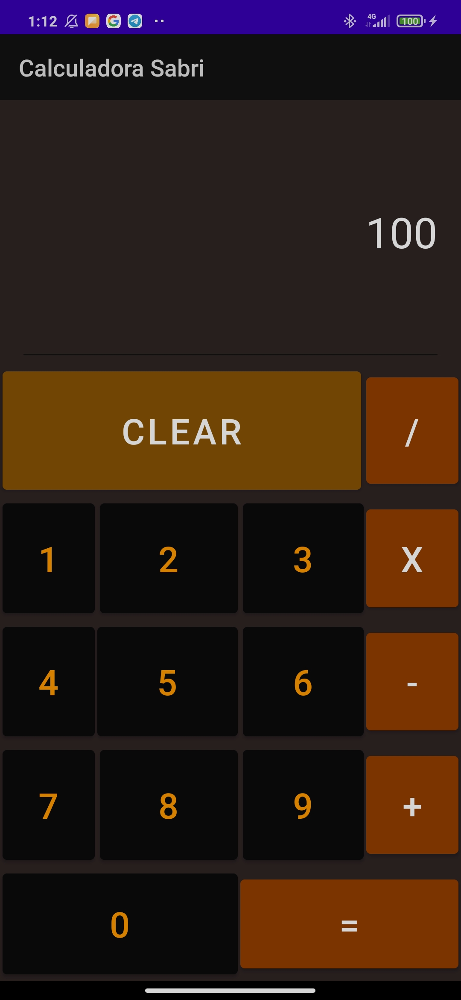
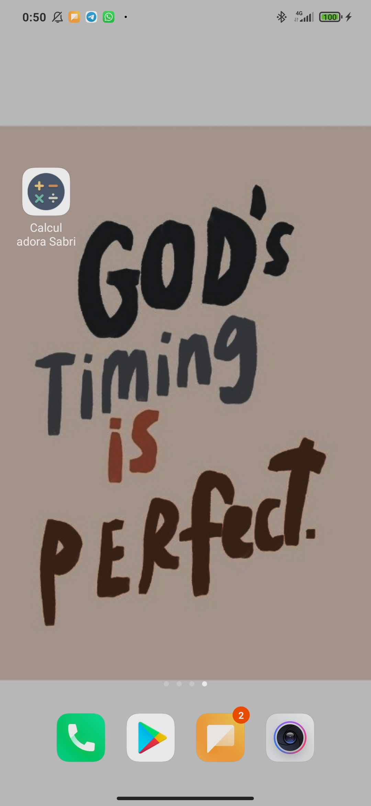
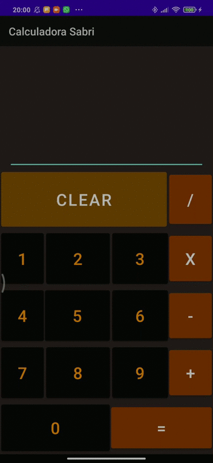

  

## DESCRIPCIÓN 🖊️ ## 

Aplicación de simulación de calculadora con operaciones sencillas (suma, resta, multiplicación y división) desarrollada en Java desde la plataforma Android Studio.
Compatible con Android 5.0 Lollipop (API 21) y sucesores.

  

- - -

## FUNCIONAMIENTO 📌 🧮 ## 

#### DISEÑO APP EN IDE #### 
  

  

  

- - -

#### VISTA APP EN DISPOSITIVO ANDROID ####
  

  
  &nbsp; &nbsp; &nbsp; &nbsp; &nbsp; &nbsp; &nbsp; &nbsp; &nbsp; &nbsp; &nbsp; &nbsp; &nbsp; &nbsp; &nbsp;
  

  

- - -

#### EJECUCIÓN APP #### 
  

  

  

- - -

## DESCARGA ⬇️ ## 
  
Descarga y prueba la aplicación [aquí](https://github.com/SabrinaOC/SabrinaEjerciciosEntornosDesarrollo/blob/master/src/androidStudio/Apk/calcSabri.apk).

  

  

- - -

> 
When I first got into technology I didn't really understand what open source was. Once I started writing software, I realized how important this would be.
>  — Matt Mullenweg 

